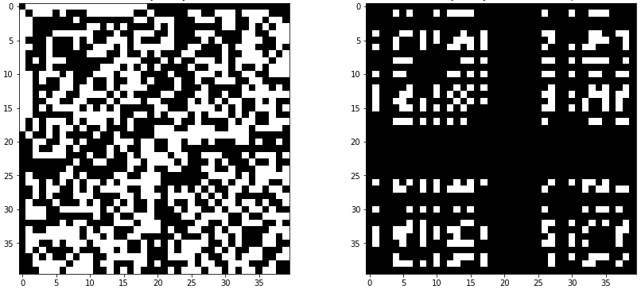

# Girvan-Newman Implementation for Highest Modularity



This has been made as a homework of ITU - Graph Theory course. This repository provides from-scratch implementation for Girvan-Newman algorithm.

## Running the Analysis

You can run the notebook file to execute full pipeline.

# Please cite this repository when using the content:

```latex
@misc{ozturk2021_gnewman,
  author = {Anil Ozturk},
  title = {Girvan-Newman Implementation for Highest Modularity},
  year = {2021},
  publisher = {GitHub},
  journal = {GitHub repository},
  howpublished = {\url{https://github.com/nlztrk/girvan_newman}},
}
```